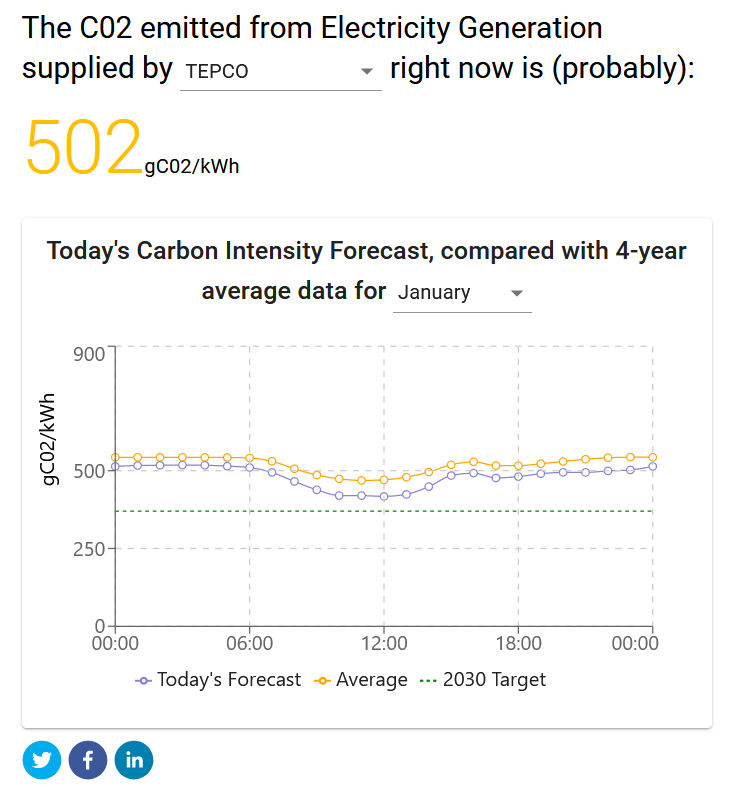

# [DEPRECIATED]
This repo has been depreciated and rebuilt in the new [Denki Carbon repo](https://github.com/FraserTooth/denki-carbon) 

# 🔌 Japan Grid Carbon API Website 🔌

This is the [website](https://denkicarbon.jp/) built to show off and demonstrate the [Japan Grid Carbon API](https://github.com/FraserTooth/japan_grid_carbon_api).

Its built mostly using `React` in `Typescript` but also uses `Recharts` & `i18next`

> 

### 🆘 How to Contribute

- Create an Issue to Explain your Problem, Feature
- Fork the Project
- Clone Locally
- `yarn`
- Add a `.env` file to your project root with:
  - REACT_APP_API_URL=`https://us-central1-japan-grid-carbon-api<ENVIRONMENT>.cloudfunctions.net/api/v0.1`
    - Environment is nothing for Production, `-staging` for Staging
- Make and commit your changes
- Open a PR to the master branch of this repo with a detailed explanation of your work (inc. screenshots)
- Guidelines in [CONTRIBUTING.md](CONTRIBUTING.md)

#### 👍 Guidelines:

- ✨ Design preference is to make the Japanese translation look good before the English version.

### 🌏 Environments
- 🧼 Staging - [staging.denkicarbon.jp](https://staging.denkicarbon.jp/) - Branch: `master`
- 💪 Production - [denkicarbon.jp](https://denkicarbon.jp/) - Branch: `production`
- _(every PR will create a [Preview Deployment](https://vercel.com/docs/platform/deployments#preview), which will have a unique URL and use the staging API)_
